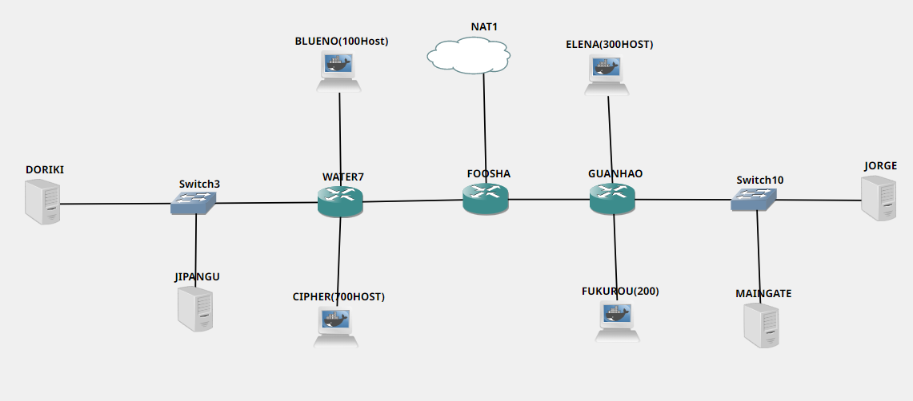
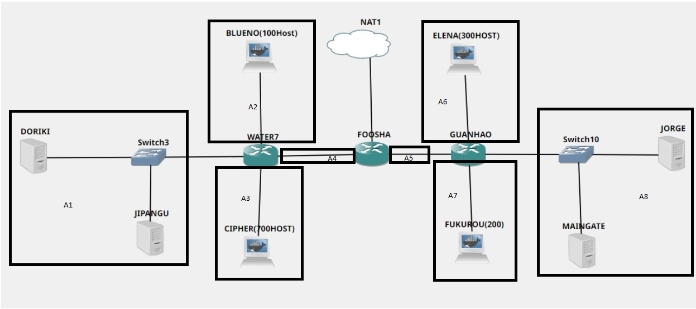

# Jarkom-Modul-5-A11-2021

Modul 5

#

1. Frederick William Edlim 05111940000016
2. Thomas Dwi Awaka 05111940000021
3. Allam Taju Sarof 05111940000053

#

Setelah kalian mempelajari semua modul yang telah diberikan, Luffy ingin meminta bantuan untuk terakhir kalinya kepada kalian. Dan kalian dengan senang hati mau membantu Luffy.

A. Tugas pertama kalian yaitu membuat topologi jaringan sesuai dengan rancangan yang diberikan Luffy dibawah ini:


## GNS3
Keterangan : 	Doriki adalah DNS Server

Jipangu adalah DHCP Server

Maingate dan Jorge adalah Web Server

Jumlah Host pada Blueno adalah 100 host

Jumlah Host pada Cipher adalah 700 host

Jumlah Host pada Elena adalah 300 host

Jumlah Host pada Fukurou adalah 200 host

B. Karena kalian telah belajar subnetting dan routing, Luffy ingin meminta kalian untuk membuat topologi tersebut menggunakan teknik CIDR atau VLSM. setelah melakukan subnetting,



| Subnet  |	IP |	Subnet Mask |	Netmask |	Jumlah IP   |
| --- | --- | --- | --- | --- |
| A1 (Doriki + Jipangu) |	192.174.7.128 |	255.255.255.248 |	/29 |	3   |
| A2 (Blueno)	| 192.174.7.0	| 255.255.255.128	| /25	| 101   |
| A3 (Cipher)	| 192.174.0.0	| 255.255.252.0	| /22	| 701   |
| A4 (Water7)	| 192.174.7.192	| 255.255.255.252	| /30	| 2   |
| A5 (Guanhao)	| 192.174.224	| 255.255.255.252	| /30	| 2   |
| A6 (Elena)	| 192.174.4.0	| 255.255.254.0	| /23	| 301   |
| A7 (Fukurou)	| 192.174.6.0	| 255.255.254.0	| /23	| 201   |
| A8 (Jorge + Maingate)	| 192.174.7.160	| 255.255.255.248	| /29	| 3   |
| Total		| | 255.255.248.0	| /21	| 1314  |


## IP Configuration

### Doriki

```
auto eth0
iface eth0 inet static
address 192.174.7.130
netmask 255.255.255.248
gateway 192.174.7.129
```

### Jipangu

```
auto eth0
iface eth0 inet static
address 192.174.7.131
netmask 255.255.255.248
gateway 192.174.7.129
```

### Water7

```
auto lo
iface lo inet loopback

auto eth0
iface eth0 inet static
address 192.174.7.145
netmask 255.255.255.252
gateway 192.174.7.146

auto eth1
iface eth1 inet static
address 192.174.7.129
netmask 255.255.255.248

auto eth2
iface eth2 inet static
address 192.174.7.1
netmask 255.255.255.128


auto eth3
iface eth3 inet static
address 192.174.0.1
netmask 255.255.252.0
```

### Blueno

```
auto lo
iface lo inet loopback

auto eth0
iface eth0 inet dhcp

```

### Cipher

```
auto lo
iface lo inet loopback

auto eth0
iface eth0 inet dhcp

```

### Foosha

```
auto lo
iface lo inet loopback

auto eth0
iface eth0 inet dhcp
hwaddress ether 26:f6:ae:d3:c3:14

auto eth1
iface eth1 inet static
address 192.174.7.146
netmask 255.255.255.252

auto eth2
iface eth2 inet static
address 192.174.7.149
netmask 255.255.255.252
```

### Jorge

```
auto eth0
iface eth0 inet static
address 192.174.7.138
netmask 255.255.255.248
gateway 192.174.7.137
```

### Maingate

```
auto eth0
iface eth0 inet static
address 192.174.7.139
netmask 255.255.255.248
gateway 192.174.7.137
```

### Guanhao

```
auto lo
iface lo inet loopback

auto eth0
iface eth0 inet static
address 192.174.7.150
netmask 255.255.255.252
gateway 192.174.7.149

auto eth1
iface eth1 inet static
address 192.174.7.137
netmask 255.255.255.248

auto eth2
iface eth2 inet static
address 192.174.4.1
netmask 255.255.254.0

auto eth3
iface eth3 inet static
address 192.174.6.1
netmask 255.255.255.0
```

### Elena

```
auto lo
iface lo inet loopback

auto eth0
iface eth0 inet dhcp
```

### Fukurou

```
auto lo
iface lo inet loopback

auto eth0
iface eth0 inet dhcp
```

frederick.txt

tom.txt