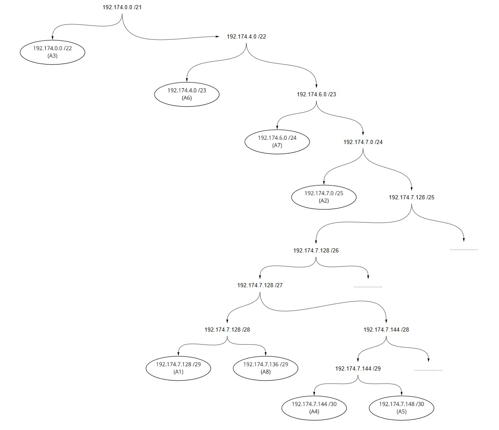

# Jarkom-Modul-5-A11-2021

Modul 5

#

1. Frederick William Edlim 05111940000016
2. Thomas Dwi Awaka 05111940000021
3. Allam Taju Sarof 05111940000053

#

Setelah kalian mempelajari semua modul yang telah diberikan, Luffy ingin meminta bantuan untuk terakhir kalinya kepada kalian. Dan kalian dengan senang hati mau membantu Luffy.

A. Tugas pertama kalian yaitu membuat topologi jaringan sesuai dengan rancangan yang diberikan Luffy dibawah ini:


## GNS3

Keterangan : Doriki adalah DNS Server

Jipangu adalah DHCP Server

Maingate dan Jorge adalah Web Server

Jumlah Host pada Blueno adalah 100 host

Jumlah Host pada Cipher adalah 700 host

Jumlah Host pada Elena adalah 300 host

Jumlah Host pada Fukurou adalah 200 host

B. Karena kalian telah belajar subnetting dan routing, Luffy ingin meminta kalian untuk membuat topologi tersebut menggunakan teknik CIDR atau VLSM. setelah melakukan subnetting,


| Subnet                | IP            | Subnet Mask     | Netmask | Jumlah IP |
| --------------------- | ------------- | --------------- | ------- | --------- |
| A1 (Doriki + Jipangu) | 192.174.7.128 | 255.255.255.248 | /29     | 3         |
| A2 (Blueno)           | 192.174.7.0   | 255.255.255.128 | /25     | 101       |
| A3 (Cipher)           | 192.174.0.0   | 255.255.252.0   | /22     | 701       |
| A4 (Water7)           | 192.174.7.192 | 255.255.255.252 | /30     | 2         |
| A5 (Guanhao)          | 192.174.224   | 255.255.255.252 | /30     | 2         |
| A6 (Elena)            | 192.174.4.0   | 255.255.254.0   | /23     | 301       |
| A7 (Fukurou)          | 192.174.6.0   | 255.255.254.0   | /23     | 201       |
| A8 (Jorge + Maingate) | 192.174.7.160 | 255.255.255.248 | /29     | 3         |
| Total                 |               | 255.255.248.0   | /21     | 1314      |



## IP Configuration

### Doriki

```
auto eth0
iface eth0 inet static
address 192.174.7.130
netmask 255.255.255.248
gateway 192.174.7.129
```

### Jipangu

```
auto eth0
iface eth0 inet static
address 192.174.7.131
netmask 255.255.255.248
gateway 192.174.7.129
```

### Water7

```
auto lo
iface lo inet loopback

auto eth0
iface eth0 inet static
address 192.174.7.145
netmask 255.255.255.252
gateway 192.174.7.146

auto eth1
iface eth1 inet static
address 192.174.7.129
netmask 255.255.255.248

auto eth2
iface eth2 inet static
address 192.174.7.1
netmask 255.255.255.128


auto eth3
iface eth3 inet static
address 192.174.0.1
netmask 255.255.252.0
```

### Blueno

```
auto lo
iface lo inet loopback

auto eth0
iface eth0 inet dhcp

```

### Cipher

```
auto lo
iface lo inet loopback

auto eth0
iface eth0 inet dhcp

```

### Foosha

```
auto lo
iface lo inet loopback

auto eth0
iface eth0 inet dhcp
hwaddress ether 26:f6:ae:d3:c3:14

auto eth1
iface eth1 inet static
address 192.174.7.146
netmask 255.255.255.252

auto eth2
iface eth2 inet static
address 192.174.7.149
netmask 255.255.255.252
```

### Jorge

```
auto eth0
iface eth0 inet static
address 192.174.7.138
netmask 255.255.255.248
gateway 192.174.7.137
```

### Maingate

```
auto eth0
iface eth0 inet static
address 192.174.7.139
netmask 255.255.255.248
gateway 192.174.7.137
```

### Guanhao

```
auto lo
iface lo inet loopback

auto eth0
iface eth0 inet static
address 192.174.7.150
netmask 255.255.255.252
gateway 192.174.7.149

auto eth1
iface eth1 inet static
address 192.174.7.137
netmask 255.255.255.248

auto eth2
iface eth2 inet static
address 192.174.4.1
netmask 255.255.254.0

auto eth3
iface eth3 inet static
address 192.174.6.1
netmask 255.255.255.0
```

### Elena

```
auto lo
iface lo inet loopback

auto eth0
iface eth0 inet dhcp
```

### Fukurou

```
auto lo
iface lo inet loopback

auto eth0
iface eth0 inet dhcp
```

C. Kalian juga diharuskan melakukan Routing agar setiap perangkat pada jaringan tersebut dapat terhubung.

### Routing Foosha

```
route add -net 192.174.7.128 netmask 255.255.255.248 gw 192.174.7.145
route add -net 192.174.7.0 netmask 255.255.255.128 gw 192.174.7.145
route add -net 192.174.0.0 netmask 255.255.252.0 gw 192.174.7.145

route add -net 192.174.4.0 netmask 255.255.254.0 gw 192.174.7.150
route add -net 192.174.6.0 netmask 255.255.255.0 gw 192.174.7.150
route add -net 192.174.7.136  netmask 255.255.255.248 gw 192.174.7.150
```

D. Tugas berikutnya adalah memberikan ip pada subnet Blueno, Cipher, Fukurou, dan Elena secara dinamis menggunakan bantuan DHCP server. Kemudian kalian ingat bahwa kalian harus setting DHCP Relay pada router yang menghubungkannya.

### Foosha

```
iptables -t nat -A POSTROUTING -o eth0 -j MASQUERADE -s 192.174.0.0/21
```

## DHCP Server

### Jipangu

```bash
echo "nameserver 192.168.122.1" > /etc/resolv.conf
apt-get install isc-dhcp-server -y
```

/etc/default/isc-dhcp-server

```
INTERFACES="eth0"
```

/etc/dhcp/dhcpd.conf

```
# Blueno
subnet 192.174.7.0 netmask 255.255.255.128 {
        range 192.174.7.2 192.174.7.126;
        option routers 192.174.7.1;
        option broadcast-address 192.174.7.127;
        option domain-name-servers 192.174.7.130;
        default-lease-time 600;
        max-lease-time 7200;
}

# Chiper
subnet 192.174.0.0 netmask 255.255.252.0 {
        range 192.174.0.2 192.174.3.254;
        option routers 192.174.0.1;
        option broadcast-address 192.174.3.255;
        option domain-name-servers 192.174.7.130;
        default-lease-time 600;
        max-lease-time 7200;
}

# Elena
subnet 192.174.4.0 netmask 255.255.254.0 {
        range 192.174.4.2 192.174.5.254;
        option routers 192.174.4.1;
        option broadcast-address 192.174.5.255;
        option domain-name-servers 192.174.7.130;
        default-lease-time 600;
        max-lease-time 7200;
}

# Fukurou
subnet 192.174.6.0 netmask 255.255.255.0 {
        range 192.174.6.2 192.174.6.254;
        option routers 192.174.6.1;
        option broadcast-address 192.174.6.255;
        option domain-name-servers 192.174.7.130;
        default-lease-time 600;
        max-lease-time 7200;
}

# Open way to router
subnet 192.174.7.128 netmask 255.255.255.248 {
        option routers 192.174.7.129;
}
```

## DHCP Relay

### Water7

```bash
echo "nameserver 192.168.122.1" > /etc/resolv.conf
apt-get install isc-dhcp-relay -y
```

/etc/default/isc-dhcp-relay

```
SERVERS="192.174.7.131"

INTERFACES="eth0 eth1 eth2 eth3"

OPTIONS=""
```

### Guanhao

```bash
echo "nameserver 192.168.122.1" > /etc/resolv.conf
apt-get install isc-dhcp-relay -y
```

/etc/default/isc-dhcp-relay

```
SERVERS="192.174.7.131"

INTERFACES="eth0 eth1 eth2 eth3"

OPTIONS=""
```

## DNS Server

### Doriki

1. Agar topologi yang kalian buat dapat mengakses keluar, kalian diminta untuk mengkonfigurasi Foosha menggunakan iptables, tetapi Luffy tidak ingin menggunakan MASQUERADE.

    ```bash
    iptables -t nat -A POSTROUTING -s 192.174.0.0/21 -o eth0 -j SNAT --to-source 192.168.122.8
    ```

2. Kalian diminta untuk mendrop semua akses HTTP dari luar Topologi kalian pada server yang merupakan DHCP Server dan DNS Server demi menjaga keamanan.

    ### Doriki

    ```bash
    iptables -A FORWARD -d 192.174.7.128/29 -i eth0 -p tcp --dport 80 -j DROP
    iptables -A FORWARD -d 192.174.7.128/29 -i eth0 -p tcp --dport 443 -j ACCEPT
    ```

    ### Jipangu

    ```bash
    iptables -A FORWARD -d 192.174.7.128/29 -i eth0 -p tcp --dport 80 -j DROP
    iptables -A FORWARD -d 192.174.7.128/29 -i eth0 -p tcp --dport 443 -j ACCEPT
    ```

3. Karena kelompok kalian maksimal terdiri dari 3 orang. Luffy meminta kalian untuk membatasi DHCP dan DNS Server hanya boleh menerima maksimal 3 koneksi ICMP secara bersamaan menggunakan iptables, selebihnya didrop.

    Memasukkan iptables berikut ke dalam DHCP Server (Jipangu) serta DNS Server (Doriki)

    ```bash
    iptables -A INPUT -m state --state ESTABLISHED,RELATED -j ACCEPT
    iptables -A INPUT -p icmp -m connlimit --connlimit-above 3 --connlimit-mask 0 -j DROP
    ```

    Kemudian kalian diminta untuk membatasi akses ke Doriki yang berasal dari subnet Blueno, Cipher, Elena dan Fukuro dengan beraturan sebagai berikut

4. Akses dari subnet Blueno dan Cipher hanya diperbolehkan pada pukul 07.00 - 15.00 pada hari Senin sampai Kamis.

    ## Doriki

    ### From Cipher

    ```bash
    iptables -A INPUT -s 192.174.0.0/22 -m time --timestart 07:00 --timestop 15:00 --weekdays Mon,Tue,Wed,Thu -j ACCEPT
    iptables -A INPUT -s 192.174.0.0/22 -j REJECT
    ```

    ### From Blueno

    ```bash
    iptables -A INPUT -s 192.174.7.0/25 -m time --timestart 07:00 --timestop 15:00 --weekdays Mon,Tue,Wed,Thu -j ACCEPT
    iptables -A INPUT -s 192.174.7.0/25 -j REJECT
    ```

5. Akses dari subnet Elena dan Fukuro hanya diperbolehkan pada pukul 15.01 hingga pukul 06.59 setiap harinya.

    Selain itu di reject

    ## Doriki

    ### From Elena

    ```bash
    iptables -A INPUT -s 192.174.4.0/23 -m time --timestart 15:01 --timestop 06:59 -j ACCEPT
    iptables -A INPUT -s 192.174.4.0/23 -j REJECT
    ```

    ### From Fukurou

    ```bash
    iptables -A INPUT -s 192.174.6.0/24 -m time --timestart 15:01 --timestop 06:59 -j ACCEPT
    iptables -A INPUT -s 192.174.6.0/24 -j REJECT
    ```

6. Karena kita memiliki 2 Web Server, Luffy ingin Guanhao disetting sehingga setiap request dari client yang mengakses DNS Server akan didistribusikan secara bergantian pada Jorge dan Maingate

    Guanhao

    ```bash
    iptables -A PREROUTING -t nat -p tcp -d 192.174.7.128/29 -m statistic --mode nth --every 2 --packet 0 -j DNAT --to-destination  192.174.7.138
    iptables -A PREROUTING -t nat -p tcp -d 192.174.7.128/29 -j DNAT --to-destination 192.174.7.139
    iptables -t nat -A POSTROUTING -p tcp -d 192.174.7.138 -j SNAT --to-source 192.174.7.128
    iptables -t nat -A POSTROUTING -p tcp -d 192.174.7.139 -j SNAT --to-source 192.174.7.128
    ```

    Menginstall Apache2 di Jorge dan Maingate

    index.html → Jorge

    

    index.html → Maingate

    

    Luffy berterima kasih pada kalian karena telah membantunya. Luffy juga mengingatkan agar semua aturan iptables harus disimpan pada sistem atau paling tidak kalian menyediakan script sebagai backup.
